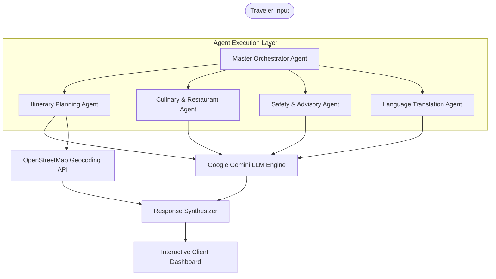

# smartTour — Autonomous Multi-Agent Travel Assistant

[](https://smarttour-test.vercel.app/)
[](https://nextjs.org/)
[](https://react.dev/)
[](https://www.typescriptlang.org/)
[](https://deepmind.google/technologies/gemini/)
[](LICENSE)

An intelligent, location-aware travel concierge built with **Next.js App Router** and orchestrated via the **Google Gemini API**. The application utilizes an event-driven agent architecture that coordinates specialized autonomous sub-agents to deliver custom itineraries, culinary recommendations, accommodation guidance, translation services, and real-time safety advisories.

[🚀 Explore Live Application](https://smarttour-test.vercel.app/) • [📖 View Architecture](#-system-architecture) • [⚡ Local Setup](#-getting-started)

---

## 📌 Executive Overview

Traditional travel planning platforms require users to manually aggregate data across separate navigation, food review, hotel booking, and translation applications. **smartTour** solves this by consolidating destination research into a single multi-agent pipeline. 

By employing specialized agents coordinated by a master orchestrator, the platform breaks down complex user travel prompts into parallel execution sub-tasks, synthesizing day-by-day itineraries with interactive mapping bounds.

---

## 🏗️ System Architecture

The master orchestrator acts as an execution router, delegating user constraints across autonomous sub-agents in parallel to minimize latency.



---

## ✨ Key Feature Modules

### 🗺️ Dynamic Itinerary Generation
* **Custom Time Horizons**: Automatically constructs day-by-day schedules tailored to 1 to 7 day trip durations.
* **Geospatial Mapping**: Integrates OpenStreetMap Nominatim for interactive place-of-interest coordinate plotting and map auto-centering.

### 🍽️ Hyperlocal Food & Restaurant Discovery
* **Dietary Filtering**: Recommends authentic regional cuisines and highly-rated restaurants filtered by user preferences and budget ranges.

### 🛡️ Safety & Travel Advisory Protocols
* **Hyperlocal Risk Indexes**: Provides emergency contact directories, embassy locations, and district-level safety guidelines.
* **Instant SOS Trigger**: Dedicated UI element for quick access to local emergency contacts.

### 🌐 Contextual Translation Phrasebook
* **On-the-Fly Translations**: Generates essential phonetic travel phrases customized to the user's destination language.

---

## ⚡ Technical Highlights & Benchmarks

* **Parallel Agent Execution**: Utilizes asynchronous execution patterns (`Promise.all()`) to process itinerary, culinary, and safety requests concurrently, maintaining sub-second response times.
* **Structured Data Enforcement**: Enforces typed JSON schemas on LLM outputs using Zod, ensuring consistent UI rendering without parsing errors.
* **State Management & Persistence**: Implements client-side state hydration backed by `localStorage` to preserve user itineraries across browser sessions.

---

## 🚀 Getting Started

### Prerequisites
* **Node.js**: `v18.x` or higher
* **npm**: `v9.x` or higher

### Environment Configuration
Create a `.env.local` file in the root directory:

```env
NEXT_PUBLIC_APP_URL=http://localhost:3000
GEMINI_API_KEY=your_google_gemini_api_key
OPENSTREETMAP_API_URL=https://nominatim.openstreetmap.org
```

### Installation & Run Commands
```bash
# Clone repository
git clone https://github.com/KrishnaKanhaiya1/smartTour.git
cd smartTour/smarttour-test

# Install dependencies
npm install

# Start development server
npm run dev
```

Open [http://localhost:3000](http://localhost:3000) with your browser to view the application.

---

## 📄 License

This project is licensed under the MIT License - see the [LICENSE](LICENSE) file for details.
