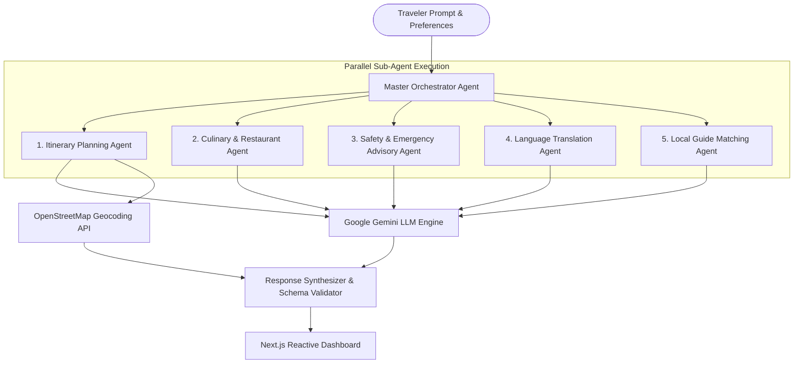

# 🗺️ smartTour — Autonomous Multi-Agent Travel Assistant

[](https://smarttour-test.vercel.app/)
[](https://nextjs.org/)
[](https://react.dev/)
[](https://www.typescriptlang.org/)
[](https://tailwindcss.com/)
[](https://deepmind.google/technologies/gemini/)

An intelligent, location-aware travel concierge built with **Next.js 14 App Router** and orchestrated via the **Google Gemini API**. The application coordinates specialized sub-agents to deliver custom itineraries, culinary recommendations, accommodation guidance, translation services, and localized safety advisories.

[🚀 Launch Live Application](https://smarttour-test.vercel.app/) • [📖 Architecture](#-system-architecture) • [✨ Feature Deep Dive](#-feature-deep-dive) • [⚡ Getting Started](#-getting-started)

---

## 📌 Executive Summary

Traditional travel planning platforms require users to manually gather information across multiple navigation, food review, hotel booking, and translation services. **smartTour** simplifies this process by integrating destination research into a single multi-agent pipeline.

By employing specialized autonomous agents managed by a master orchestrator, the platform breaks down complex user travel prompts into parallel execution tasks, producing day-by-day itineraries complete with interactive mapping coordinates and real-time travel safety advisories.

---

## 🏗️ System Architecture

The master orchestrator delegates user travel parameters across autonomous sub-agents in parallel to minimize response latency.



---

## ✨ Feature Deep Dive

### 📅 Day-by-Day Itinerary Engine
* **Flexible Schedules**: Constructs day-by-day itineraries tailored to 1 to 7 day trips based on budget and pace.
* **Geospatial Mapping**: Integrates OpenStreetMap Nominatim for place-of-interest coordinate plotting and map auto-centering.

### 🍽️ Culinary & Restaurant Discovery
* **Dietary Customization**: Recommends regional dishes and top-rated restaurants filtered by user preferences and budget.

### 🛡️ Safety & Travel Advisory Protocols
* **Hyperlocal Risk Indexes**: Provides emergency contact directories, embassy locations, and district safety guidelines.
* **SOS Quick Action**: Dedicated UI elements for quick access to local emergency contacts.

### 🌐 Contextual Translation Phrasebook
* **Phonetic Phrases**: Generates essential phonetic travel phrases customized to the target language.

### 👤 Local Guide Matching
* **Verified Local Contacts**: Matches travelers with guides based on spoken languages and interest tags.

---

## 💻 Tech Stack & Dependencies

* **Frontend**: Next.js 14 (App Router), React 18, Tailwind CSS, Lucide Icons
* **AI & API Services**: Google Gemini API, OpenStreetMap Nominatim API
* **State & Schema Validation**: React Hooks, Zod, LocalStorage Persistence

---

## 🚀 Getting Started

### Prerequisites
* **Node.js**: `v18.x` or higher
* **npm**: `v9.x` or higher

### Environment Configuration
Create a `.env.local` file in the root directory:

```env
NEXT_PUBLIC_APP_URL=http://localhost:3000
GEMINI_API_KEY=your_google_gemini_api_key
OPENSTREETMAP_API_URL=https://nominatim.openstreetmap.org
```

### Installation & Execution Commands
```bash
# Clone the repository
git clone https://github.com/KrishnaKanhaiya1/smartTour.git
cd smartTour/smarttour-test

# Install dependencies
npm install

# Start local development server
npm run dev
```

Open [http://localhost:3000](http://localhost:3000) in your browser to view the application.

---

## 📄 License

Distributed under the MIT License. See [LICENSE](LICENSE) for details.
