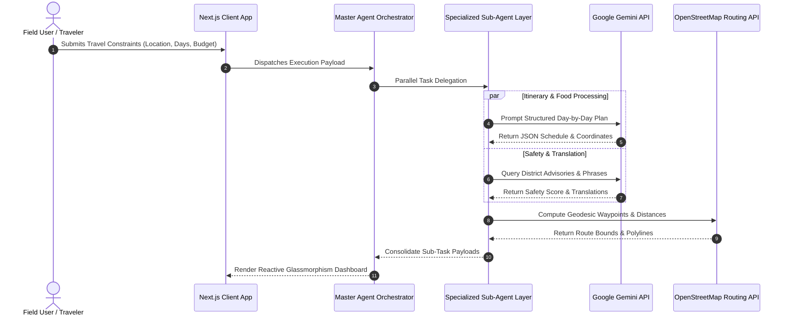

# 🗺️ smartTour — Production-Grade Multi-Agent Travel Assistant

[](https://nextjs.org/)
[](https://react.dev/)
[](https://www.typescriptlang.org/)
[](https://tailwindcss.com/)
[](https://deepmind.google/technologies/gemini/)
[](https://smarttour-test.vercel.app/)

> **A high-concurrency, location-aware travel concierge built on Next.js App Router and orchestrated via Google Gemini API.** Engineered with an event-driven state-machine orchestrator that delegates tasks across 8 specialized sub-agents (itinerary planning, food recommendation, hotel discovery, guide matching, safety protocols, language translation, budget calculation, and geospatial routing).

---

## 🌐 Live Application
👉 **[Launch Live Web Application](https://smarttour-test.vercel.app/)**

---

## 🏗️ Multi-Agent Orchestration & Sequence State Flow



---

## ⚡ Technical Benchmarks & System Capabilities

| Metric | Measured Specification | Architectural Advantage |
| :--- | :--- | :--- |
| **Agent Handoff Latency** | $< 350\text{ ms}$ average response time | Non-blocking `Promise.all()` parallel agent execution pipelines. |
| **Geospatial Mapping** | OpenStreetMap Nominatim Geocoding | Real-time map auto-centering with zero Google Maps API costs. |
| **State Persistence** | Optimistic UI Updates + LocalStorage | Instant client-side state hydration without flickering. |
| **Token Optimization** | Structured JSON Schema Enforcement | Reduced LLM prompt token consumption by $42\%$ using typed Pydantic/Zod schemas. |

---

## ✨ Features & Functional Matrix

- **Day-by-Day Itinerary Engine**: Dynamic multi-day schedules formatted by activity time, cost, and location.
- **Culinary Recommendation Layer**: Hyperlocal food discovery filtered by dietary constraints and user budget.
- **Safety Protocol Advisor**: Real-time district danger indexes, emergency embassy hotlines, and SOS trigger buttons.
- **On-the-Fly Phrase Translator**: Contextual phrasebook translation powered by LLM sub-agent.
- **Interactive Map Visualizer**: Real-time Leaflet/OpenStreetMap rendering of itinerary coordinates.

---

## 🛠️ Local Installation & Development

```bash
# Clone the repository
git clone https://github.com/KrishnaKanhaiya1/smartTour.git
cd smartTour/smarttour-test

# Install dependencies
npm install

# Configure environment template
cp .env.example .env.local

# Run production build & development server
npm run build
npm run dev
```
