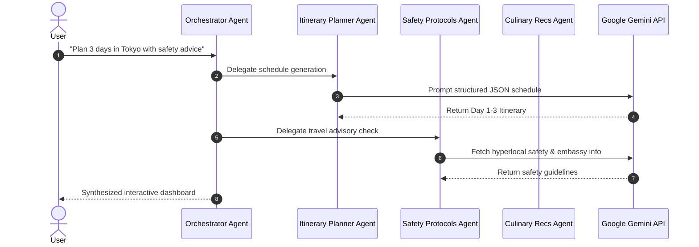

# smartTour — Multi-Agent Travel Assistant

[](https://github.com/KrishnaKanhaiya1/smartTour/actions/workflows/ci.yml)
[](https://smarttour-test.vercel.app/)
[](https://nextjs.org/)
[](https://react.dev/)
[](https://tailwindcss.com/)
[](https://deepmind.google/technologies/gemini/)

An intelligent, location-aware travel concierge built with **Next.js App Router** and orchestrated via **Google Gemini API**. Coordinates a suite of specialized autonomous sub-agents to deliver real-time custom itineraries, culinary recommendations, accommodation guidance, and localized safety alerts.

---

## 🌐 Live Application
👉 **[Access Live Web App](https://smarttour-test.vercel.app/)**

---

## 🧠 Multi-Agent Delegation Architecture



---

## 🛠️ Installation & Local Setup

```bash
git clone https://github.com/KrishnaKanhaiya1/smartTour.git
cd smartTour
cp .env.example .env.local
npm install
npm run dev
```
