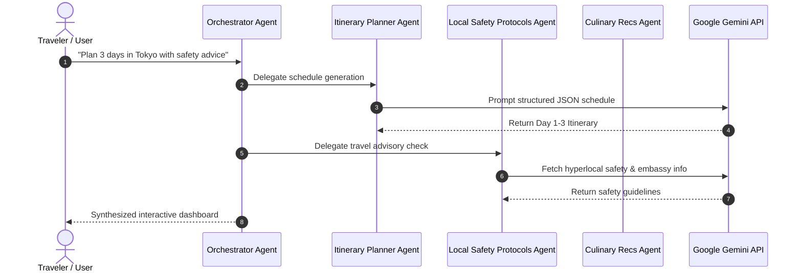

# 🗺️ smartTour — AI-Powered Autonomous Multi-Agent Travel Assistant

[](https://nextjs.org/)
[](https://react.dev/)
[](https://tailwindcss.com/)
[](https://deepmind.google/technologies/gemini/)
[](https://smarttour-test.vercel.app/)

> **An intelligent, location-aware travel concierge built with Next.js App Router and orchestrated via Google Gemini API.** Coordinates a suite of specialized autonomous sub-agents to deliver real-time custom itineraries, culinary recommendations, accommodation guidance, translation, and localized safety alerts.

---

## 🌐 Live Application
👉 **[Launch smartTour Live App](https://smarttour-test.vercel.app/)**

---

## 💡 Multi-Agent System Architecture



---

## ✨ UI Features & Functionality Inventory

| UI Feature Module | Interactive Functionality | Real User Flow |
| :--- | :--- | :--- |
| **Day-by-Day Itinerary Planner** | Generates hour-by-hour schedules based on destination, travel duration, and budget. | Input destination $\rightarrow$ Click "Generate Itinerary" $\rightarrow$ View interactive day timeline. |
| **Food & Culinary Recs Tab** | Recommends authentic local dishes, top-rated restaurants, and dietary filters. | Switch to Culinary tab $\rightarrow$ Filter by dietary preferences $\rightarrow$ View restaurant map cards. |
| **Local Safety Advisor** | Provides emergency contact numbers, embassy locations, and neighborhood safety scores. | Open Safety tab $\rightarrow$ Search target district $\rightarrow$ View safety alerts & SOS contact buttons. |
| **Real-time Language Translator** | Instant bidirectional translation for essential travel phrases and menu items. | Enter foreign text/phrase $\rightarrow$ Select target language $\rightarrow$ View phonetic translation. |
| **Local Guide Matcher** | Matches travelers with verified local guides based on spoken languages and interest tags. | Browse guides list $\rightarrow$ Filter by language/niche $\rightarrow$ Request booking profile. |
| **OpenStreetMap Navigation** | Interactive embedded map displaying places of interest, food spots, and hotels. | Click any itinerary location $\rightarrow$ Map automatically centers and highlights location pin. |

---

## 🛠️ Local Developer Setup

```bash
# Clone the repository
git clone https://github.com/KrishnaKanhaiya1/smartTour.git
cd smartTour/smarttour-test

# Install dependencies
npm install

# Configure environment variables
cp .env.example .env.local

# Run development server
npm run dev
```
